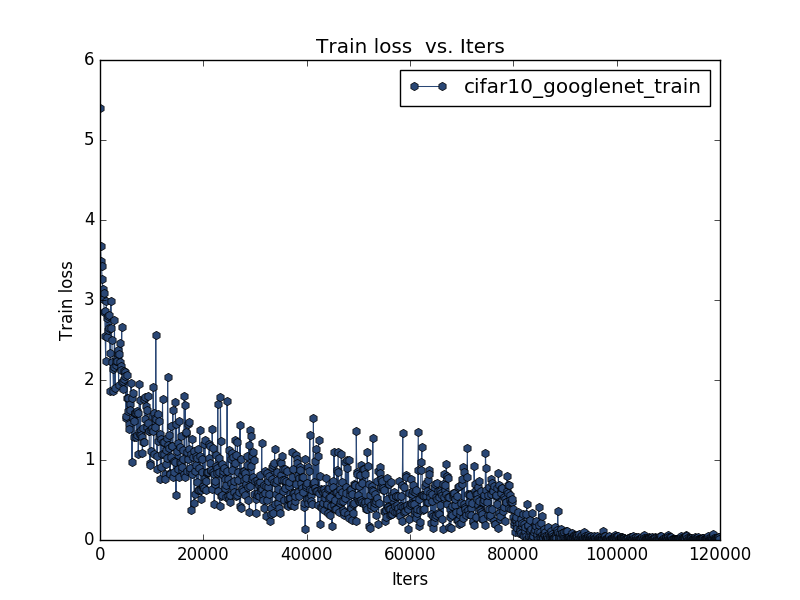
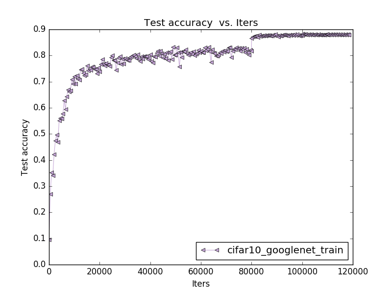

# 项目介绍
用pycaffe实现了《Going Deeper with Convolutions》提出的GoogleNet，并在cifar10数据集上训练模型。
该作者受到NiN网络的启发，提出了一种高效的深度学习框架。使用了1x1卷积（bottleneck），用于增加网络的宽度和深度，以及减少计算量。Inception模块是在naive inception的基础上加入了1x1卷积，可以有效降低计算复杂度。最后使用了avg pool。
网络的设计遵循了这样的规则：视觉信息应该在不同尺寸进行处理，然后将它们合并在一起供下一阶段使用。

# 实验步骤

将cifar10数据库转换成lmdb数据库文件

用create_cifar10_googlenet.py生成训练测试网络文件，然后用github上的netscope检查生成的训练测试网络文件是否正确

用create_cifar10_googlenet_solver.py生成solver文件

用train_net.py进行模型训练

用caffe/tools下的log分析工具分析log文件，得到训练误差变化曲线和准确率变化曲线

# 实验结果
## 训练误差

## 准确率

